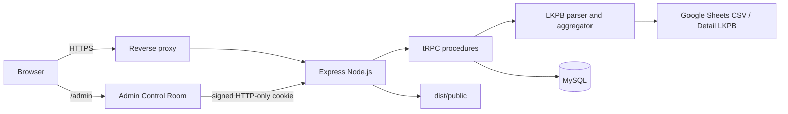

# LKPB TRACK Architecture

## Ringkasan

LKPB TRACK menggunakan arsitektur monolith Node.js yang membundel React/Vite pada client dan Express/tRPC pada server. Pendekatan ini sengaja dipilih agar aplikasi mudah dijalankan sebagai satu service di WebDev, VPS, Docker, atau systemd. Database menyimpan identitas OAuth dan konfigurasi source, sedangkan data LKPB dibaca dari spreadsheet saat dashboard melakukan query.

## Diagram komponen

## Batas komponen

| Komponen | Tanggung jawab | Aturan perubahan |
|---|---|---|
| `client/src/pages/Home.tsx` | Dashboard, filter, KPI, warning, pool board, detail table | Tidak mengambil spreadsheet langsung dari browser |
| `client/src/pages/Admin.tsx` | Login dan source registry UI | Tidak menyimpan credential atau secret |
| `server/_core/index.ts` | Express lifecycle, proxy trust, body parser, health endpoint, tRPC mount, static serving | `trust proxy` harus sesuai topologi deployment |
| `server/routers.ts` | API contract dan authorization boundary | Mutation admin wajib session + same-origin |
| `server/lkpb.ts` | Fetch CSV, parsing, normalisasi, agregasi | Parser harus fail closed terhadap summary/header yang tidak valid |
| `server/db.ts` | Query dan mutation database | Return data mentah; jangan taruh credential di DB source code |
| `server/adminAuth.ts` | Signed admin cookie, origin guard, scrypt password verification | Semua secret berasal dari server environment |
| `drizzle/schema.ts` | Source of truth schema database | Migration wajib direview dan disimpan |
| `client/src/components/ui/` | Hanya komponen UI yang dipakai runtime | Jangan menambah template component tanpa import nyata |

## Alur dashboard

1. Browser memanggil `lkpb.dashboard` melalui tRPC.
2. Server membaca source yang enabled dari `lkpb_source_settings`.
3. Server mengambil CSV tab `Detail LKPB` secara server-side.
4. Parser mengenali blok case detail, weekly status, atau daily pool metrics.
5. Baris summary dan header yang tidak valid diabaikan.
6. Server menggabungkan record, status, kategori, SLA, weekly metrics, dan pool summaries.
7. Client menerapkan filter tahun/pool dan merender hasil tanpa akses langsung ke spreadsheet.

Kegagalan satu source tidak boleh merusak seluruh dashboard. Aggregator mencatat source error dan memakai source valid yang tersisa. Jika semua source gagal, response menggunakan fallback yang ditentukan oleh implementation saat ini dan UI menampilkan indikator fallback.

## Alur admin

Admin mengirim login dari same-origin browser request. Server memeriksa origin, lalu membandingkan credential dengan hash scrypt yang tersimpan di tabel `admin_settings` (di-seed dari environment `ADMIN_USERNAME` / `ADMIN_PASSWORD` saat startup pertama). Jika valid, server menerbitkan cookie `lkpb_admin_session` yang `HttpOnly`, `SameSite=Lax`, dan `Secure` saat request dianggap HTTPS. Admin dapat mengganti password sendiri dari Control Room; hash baru disimpan di database dan meng-override nilai environment.

Mutation `toggleSource` memerlukan signed admin cookie serta origin yang sama dengan host request. Cookie tidak pernah dibaca atau dibuat oleh client JavaScript. Session memiliki TTL terbatas dan signature menggunakan HMAC-SHA256 berbasis `JWT_SECRET`.

## Trust proxy dan cookie

Express memakai `TRUST_PROXY`. Nilai `1` berarti satu reverse proxy terdekat dipercaya. Express kemudian menentukan `req.secure` dari koneksi langsung atau forwarded protocol yang datang melalui hop tepercaya. Cookie helper hanya menggunakan `req.secure`; ia tidak mempercayai header `x-forwarded-proto` secara manual.

Jika deployment memiliki dua proxy, set `TRUST_PROXY=2`. Jangan menaruh aplikasi pada akses publik langsung dengan `TRUST_PROXY` besar karena client dapat memengaruhi chain forwarded header yang tidak ditimpa oleh proxy.

## Database

MySQL menyimpan tabel `users` dan `lkpb_source_settings`. Source spreadsheet tidak disalin sebagai case permanen; spreadsheet tetap menjadi source of truth untuk data dashboard. Konfigurasi enabled/disabled disimpan agar admin dapat mengendalikan source tanpa perubahan kode.

Migration SQL berada di `drizzle/`. `pnpm db:generate` membuat migration baru dan `pnpm db:migrate` menerapkannya. Production sebaiknya hanya menjalankan migration yang sudah direview, bukan generate migration di container.

## Portability

Portability dijaga dengan beberapa keputusan berikut:

- Satu process Node.js untuk HTTP server.
- Tidak ada background worker atau filesystem state wajib.
- Build menghasilkan `dist/public` dan `dist/index.js`.
- Docker image menggunakan Node.js 22 dan pnpm lockfile.
- MySQL dapat dikelola oleh Docker Compose atau layanan database eksternal.
- Semua konfigurasi deployment dibaca dari environment.
- Health probe tersedia pada `GET /healthz`.

## Batasan yang diketahui
Source spreadsheet memerlukan akses CSV yang sesuai. OAuth Manus adalah integrasi opsional dan perlu diganti atau dinonaktifkan bila aplikasi dipindahkan ke identity provider lain. Perhitungan SLA di server menggunakan `TANGGAL JALUR AWAL` kolom spreadsheet; jika tanggal tidak dapat di-parse, fallback ke nilai statis dari kolom `SLA BERJALAN` sheet. Penomoran minggu mengikuti anchor 2 Agustus 2026 (week 1).

## References

[1]: https://expressjs.com/en/guide/behind-proxies.html "Express behind proxies guide"
[2]: https://trpc.io/docs/server/routers "tRPC routers documentation"
[3]: https://dev.mysql.com/doc/refman/8.4/en/ "MySQL 8.4 reference manual"
